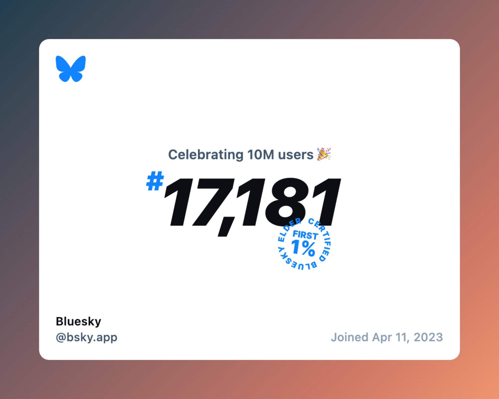

<h1 align="center">SkyFetch</h1>

  <a href="README.md">English</a> | <a href="README_zh.md">中文</a>

A Tampermonkey script that adds a download button to BlueSky posts containing images, allowing you to download the highest resolution version with customizable naming rules.

Supports multiple languages (English, Chinese, Japanese, Korean, Russian).

The code for this project was primarily written by `OpenAI o1-mini`, `claude-3.5-sonnet` and `chatgpt-4o-latest`, with numerous style and functionality design suggestions and feedback provided by me.

This project also uses the download button SVG from the [Twitter Media Downloader](https://greasyfork.org/es/scripts/423001-twitter-media-downloader) project, which is licensed under the [MIT License](https://opensource.org/licenses/MIT).

> BlueSky_Bluesky_@bsky.app_2024-09-17_1_1o2i.jpg

> BlueSky_Username_ID_DownloadDate_RandomIdentifier.jpg

## Features

- Adds a download button to posts containing images
- Automatic construction of high-resolution image links
- Downloads highest resolution version of images automatically (BlueSky platform limits to .jpg format)
- Automatic addition of image metadata to filenames
- Customizable file naming rules
- Supports multiple languages (English, Chinese, Japanese, Korean, Russian)
- Dark/Light mode support
- Local data processing to protect user privacy
- Settings panel for customization

## Installation

1. Install [Tampermonkey](https://www.tampermonkey.net/) browser extension
2. Visit [SkyFetch Script](https://github.com/CookSleep/SkyFetch-Script/raw/main/SkyFetch-Script.js)
3. Click "Install" in Tampermonkey

## How to Use

1. Browse BlueSky normally
2. When you see a post with images, click the download button in the bottom right
3. The image(s) will be downloaded automatically in highest resolution
4. Access settings through Tampermonkey menu to customize file naming

## Contributing

Contributions to the project are welcome! If you have any suggestions or want to add new features, feel free to create an Issue or Pull Request.

## License

This project is licensed under the [GNU General Public License v3.0](https://www.gnu.org/licenses/gpl-3.0.html). See the [LICENSE](LICENSE) file for details.